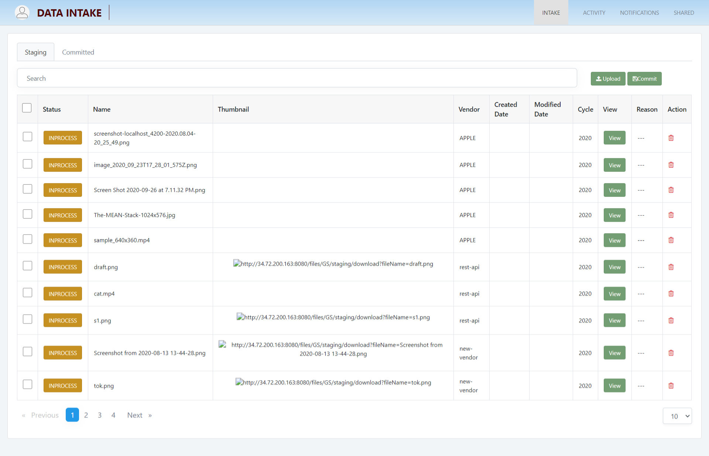
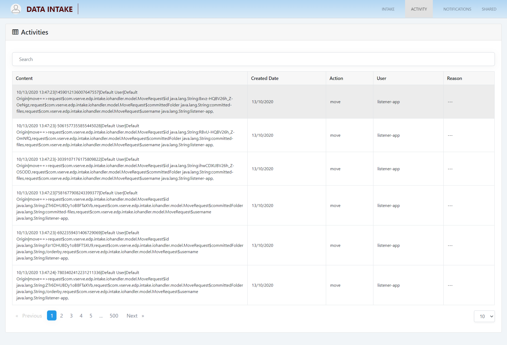
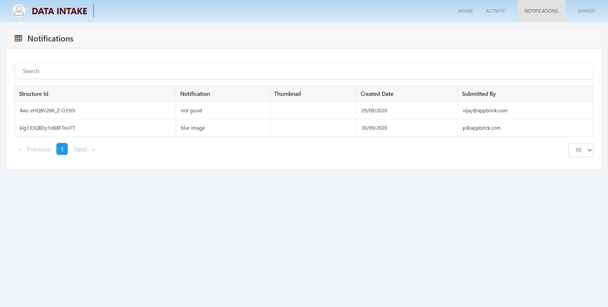
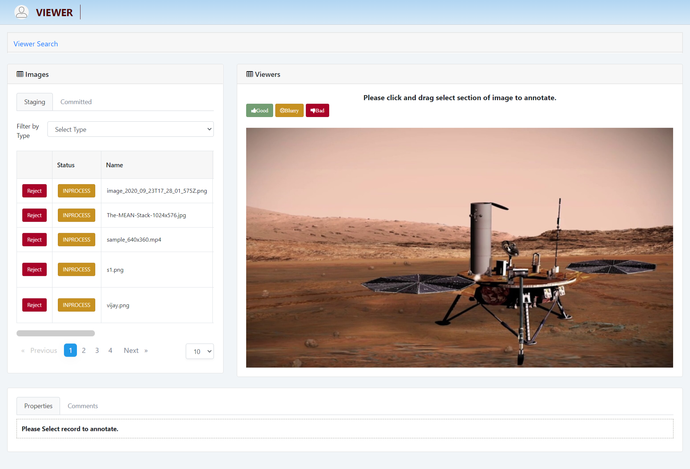
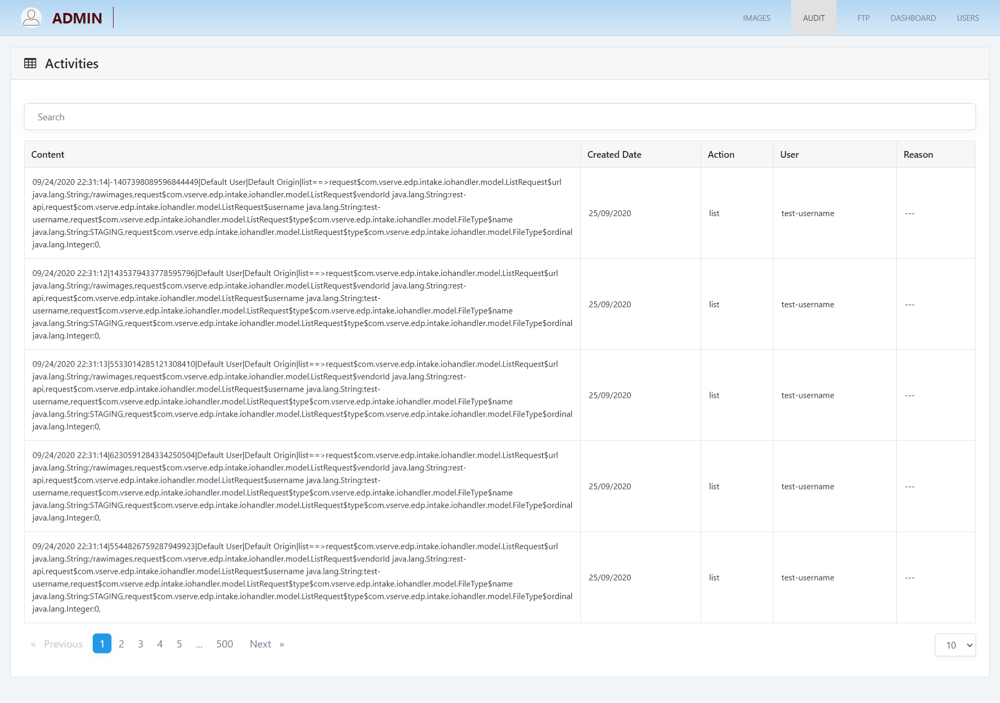
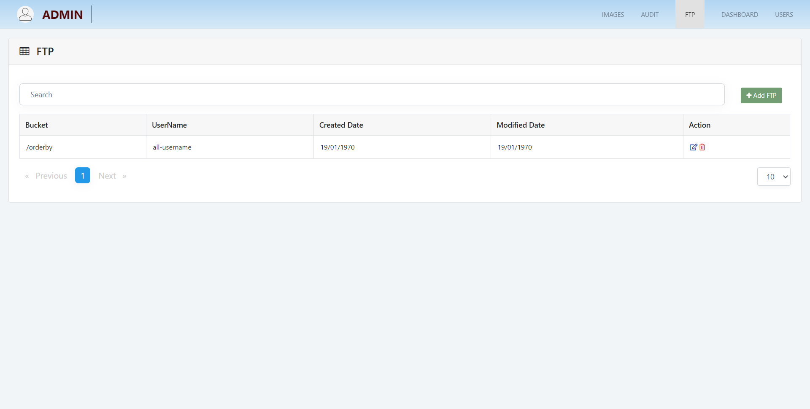
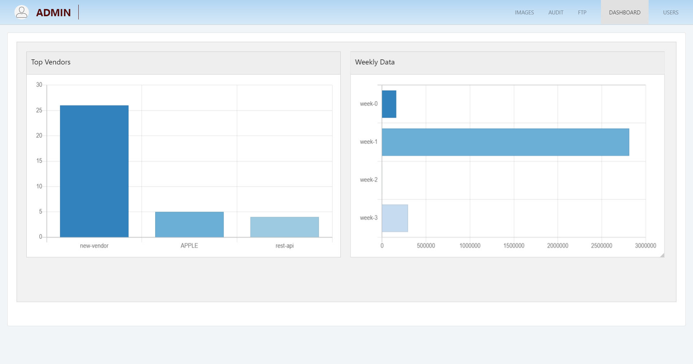

What is InsightLake Data Intake?
-----------

InsightLake Data Intake solution enables a company's vendors to upload data in secure and governed manner. A staging workspace is created for vendors where they can upload data and make modifications if necessary. Once ready they can commit the uploaded data so the company can use it.
Data Intake generates appropriate notifications to the company's data intake team to verify the quality of uploaded data. 

Data Intake allows vendors to upload variety of data sets like CSV, documents, images, videos etc.
Data Intake allows vendors to upload the data using different channels:
* Streaming (gRPC) : Mobile Apps for async data transfer
* API : Web UIs, apps
* SFTP : Desktop Apps like FileZilla
* Cloud App : Desktop 

## Data Intake

Data intake contain staging as well as committed images. videos and Lidar, vendor can upload and committed images, videos and Lidar
* Upload single and multiple Images, video and Lidar
* Commit single and multiple Images, videos and Lidar
* View Images, videos and Lidar in large format

## Vendor Activity

Intake solution allows to see the vendor activities done throughout the application.

## Notifications

Intake solution allows to see the notification related to inspector rejection of images, videos and Lidar

## Viewer

Viewers can view all types like images, videos and Lidar. It annotates images and videos. Also it can see the properties and comment of images and videos.

It can reject specific images and videos if the images and videos are not good.

## Audit

Admin can see the user activities done throughout the application.

## FTP

Admin can manage and add FTP users accounts.

## Dashboaard

Admin can see the daily data analytics and vendors activities with the help of graphical format (charts) . Realtime charts could be used for operational dashboards.

To learn more, check out [http://insightlake.com/data-intake.html](http://insightlake.com/data-intake.html)

Installation
------
* Download or clone the repository. 
* Run bin/insightlake command.
* Open browser with URL as http://localhost:8080/
* Change configuration in /conf folder to set different ports
* By default H2 database is used, you can change the database details in jdbc.properties file

Installation using docker 
------
* Download or clone the repository. 
* cd /docker
* Run `docker-compose -f docker-compose.yaml up --build`
* Open browser with URL as http://localhost:8080/
* While creating Data Location use below credentials  

        * username : root
        * password : password
        * URL :  jdbc:mysql://mysql:3306/

License
------
InsightLake Data Intake is a commercial product but distributed to be used freely. Please contact contact@insightlake.com for details.

Getting Help
----------

You can get help easily :
Community - Google Groups
Slack Channel
Twitter
Facebook
Email: contact@insightlake.com
