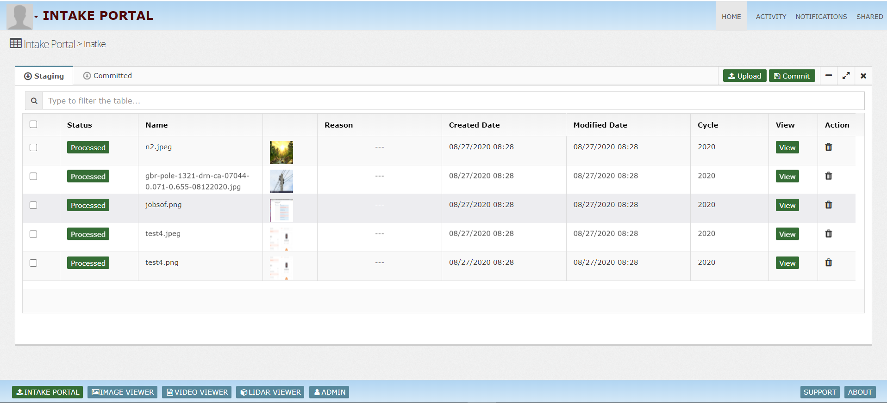
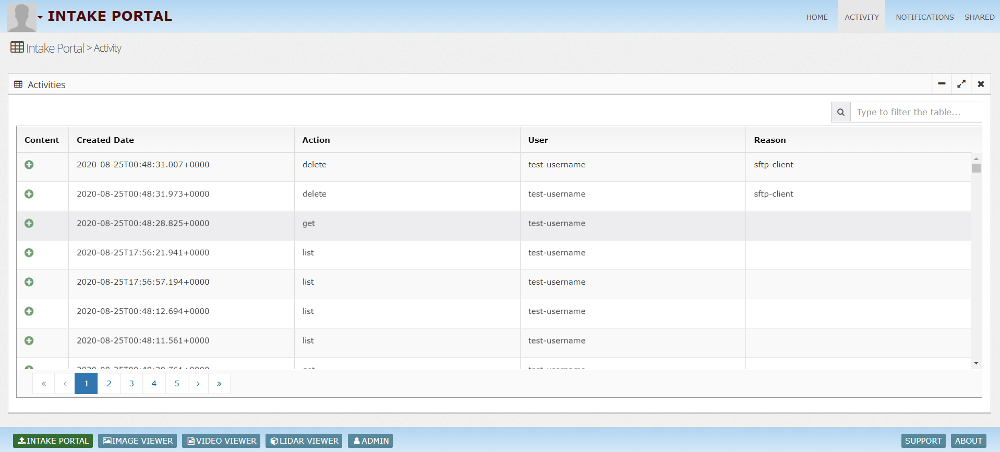
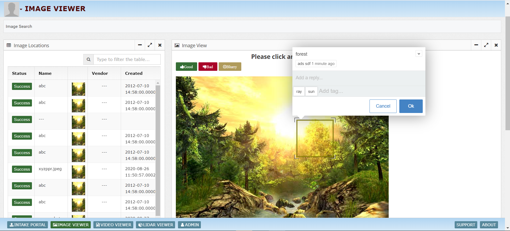
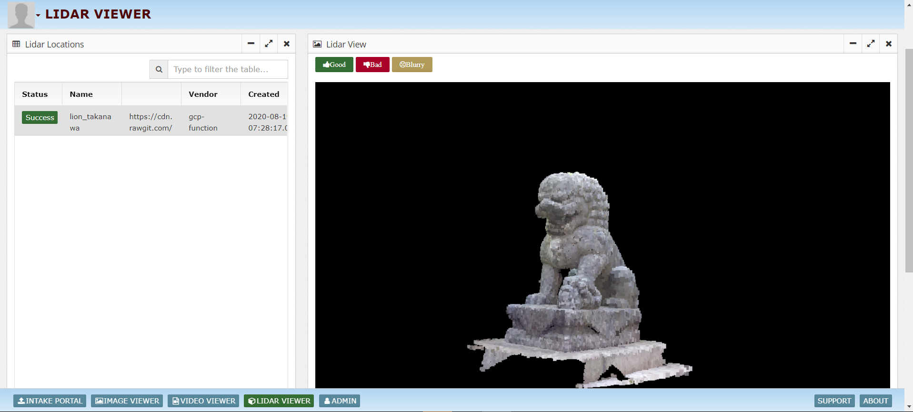
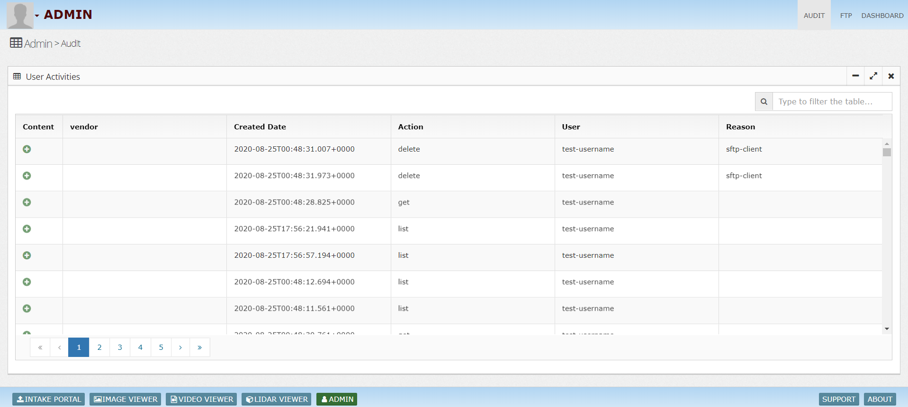
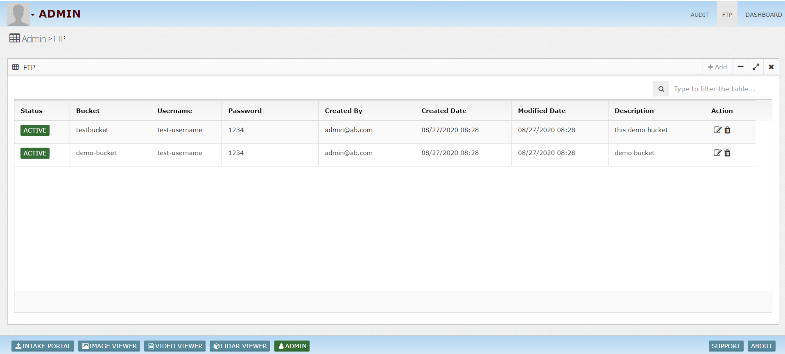
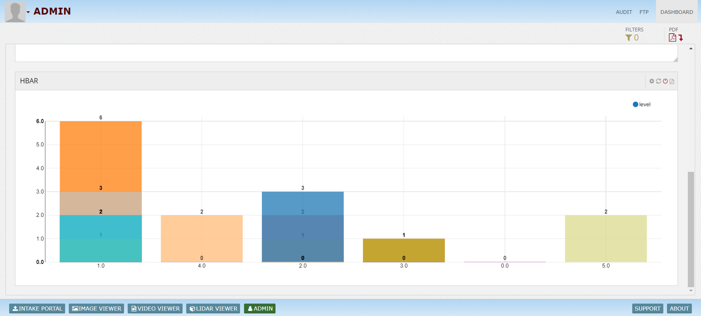

What is InsightLake Data Intake?
-----------

InsightLake Data Intake solution enables a company's vendors to upload data in secure and governed manner. A staging workspace is created for vendors where they can upload data and make modifications if necessary. Once ready they can commit the uploaded data so the company can use it.
Data Intake generates appropriate notifications to the company's data intake team to verify the quality of uploaded data. 

Data Intake allows vendors to upload variety of data sets like CSV, documents, images, videos etc.
Data Intake allows vendors to upload the data using different channels:
* Streaming (gRPC) : Mobile Apps for async data transfer
* API : Web UIs, apps
* SFTP : Desktop Apps like FileZilla
* Cloud App : Desktop 

## Data Intake

## Activity

## Notifications

## Viewer

## Image Viewer

## Video Viewer

## Lidar Viewer

## Audit

## FTP

## Dashboaard

To learn more, check out [http://insightlake.com/data-intake.html](http://insightlake.com/data-intake.html)

Installation
------
* Download or clone the repository. 
* Run bin/insightlake command.
* Open browser with URL as http://localhost:8080/
* Change configuration in /conf folder to set different ports
* By default H2 database is used, you can change the database details in jdbc.properties file

Installation using docker 
------
* Download or clone the repository. 
* cd /docker
* Run `docker-compose -f docker-compose.yaml up --build`
* Open browser with URL as http://localhost:8080/
* While creating Data Location use below credentials  

        * username : root
        * password : password
        * URL :  jdbc:mysql://mysql:3306/

License
------
InsightLake Data Intake is a commercial product but distributed to be used freely. Please contact contact@insightlake.com for details.

Getting Help
----------

You can get help easily :
Community - Google Groups
Slack Channel
Twitter
Facebook
Email: contact@insightlake.com
