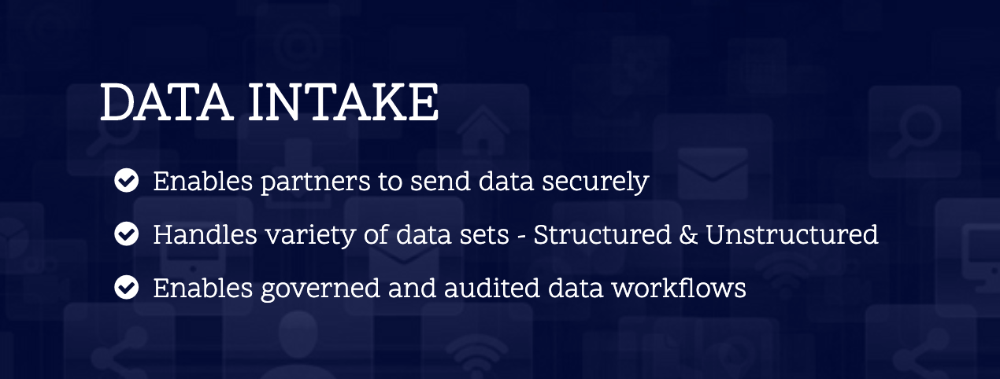
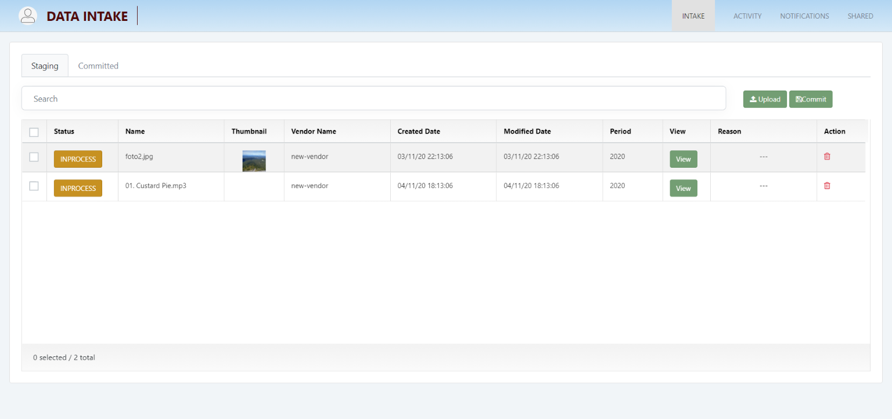

# InsightLake External Data Integration
Companies work with their partners/vendors and ingest data from them or export data to them. It is very important to establish a secure and governed framework to share data. Following are the key principals:
* Securely ingest and export data
* Ingest and export data through various channels - APIs, SFTP, Bulk Uploads, Streaming
* Ingest and export structured and unstructured data seamlessly
* Audit the inbound and outbound data transfer
* Implement governance framework using workflows so right data is ingested and exported
* Implement various actors/personas - partners, data stewards, data owners etc.
* Intelligent ML and rules driven framework

InsightLake’s external data integration solution consists of two parts:
* Data Intake - Secure & governed data intake from partners/vendors
* Managed Data Transfer - Secure & governed data export to partners/vendors

# InsightLake Data Intake
InsightLake Data Intake solution enables companies to ingest data from its partners/vendors. The partners/vendors can ingest following types of data:
* Structured - CSV, Excel, JSON, XML etc.
* Unstructured - Images, Videos, Documents, LiDAR etc.
 
Data can be uploaded using APIs, bulk and streaming manner using different channels:
* Web UI - Intuitive UI
* SFTP : Apps like FileZilla
* Desktop Applications - CLI & App
* Mobile Apps - APIs/Streaming
* IoT Devices - Streaming

Data Intake is a packaged solution which consists of Web UI, Desktop application, Mobile framework, REST, SFTP & Streaming endpoints. This solution can be easily deployed on Cloud (AWS, GCP, Azure) or on-premise. It enables a company's vendors/partners to upload data in a secure, reliable and governed manner with a workflow driven mechanism.

Below diagram shows a high level solution of Data Intake:

# API & Service Endpoints:
The Intake solution includes API & Service endpoints so any application can utilize them to ingest the data.
* Streaming for videos or large data
* REST APIs : Data upload and workflow endpoints
* Bulk Upload using native APIs

# Intake Backend
Intake solution’s backend includes the following:
* Pluggable data storage layer - ingested data could be stored in object stores like S3, GCS, Azure Blob, HDFS, NAS etc.
* Catalog Store - Ingested data catalogued for easier search
* API endpoints - REST API framework
* Audit libraries - Audit libraries, which is included in all the intake channels and workflows
* SFTP Server - Implements governed intake from SFTP clients
* Web UI backend - APIs driving the intake UI
* Core data engine - Handles data management functions like cataloguing data

A staging workspace is created for vendors/partners where they can upload the data and make modifications if necessary. Once ready they can commit the uploaded data so the company can use it.

# Data Governance
Data Intake solution implements following key aspects of data governance:
* Data ownership - Who owns the data
* Data review - Review the data completeness and correctness
* Data Quality - Identify data quality issues and notify actors
* Audits - audit all the activities

## Personas
Following are the key personas supported in the Data Intake solution
* Admin - Administers partner accountts, assign reviewers for data validations etc.
* Partner/Vendor - Uploads the data
* Data Steward - Performs the data validations
* Data Analyst - Views the data

## Lifecycle
Partners upload the data and make modifications and when done they commit the data sets.
Automated data pipelines perform quality checks using rules and ML based framework.
Administrators and Data stewards get notifications for the new data arrival. They assign the reviewers for quality checks.
Data reviewers/stewards review the data and flag and reject if the data has issues with comments.
Notifications are generated for partners, they can see the details of rejection and upload the corrected data.
All the data activities are audited and can be viewed by all

# Channel - Data Intake UI
Interactive UI is provided, which can be used by partners, admins and data stewards. Following are the screenshots of the UI.

## Security
Authentication is performed using OKTA 

## Partner/Vendor Intake
Allows partners/vendors to upload data to their staging workspace and make modifications. When they are ready they can commit the changes.

## Partner/Vendor Activity

Partners and vendors can see their data intake activities

## Notifications

Partners/vendors can see the incoming notifications from the admins/data stewards.

## Viewer

Data stewards and admins can view the uploaded data. Viewers can view all types like csv, images, documents, audios, videos and Lidar. Viewer page allows annotation & comments on the data. 
Data stewards and admins can reject the data if they see issues.

## Review
Administrators can assign reviewers for data validation.

## Audit

Admins can see the audit activities done throughout the application by all the partners/vendors.

## FTP

Admins can manage and add FTP users accounts for SFTP channel users.

## Dashboaard

Admins can see various data intake dashboards, which allows them to see partner/vendor performance, data quality issues and volume of data ingestion over a period of time.

# Channel - FTP Application

Data Intake solution starts a secure SFTP server, which can be used by vendors/partners to upload the data. Using off the shelf FTP tools like FileZilla etc. partners can connect to their staging area and upload files (csv, images, videos etc.). 

After uploading the files in the staging area vendors/partners can use the Data intake web UI for workflow management.

# Channel - Desktop Application
Desktop application is a cross platform application, which allows partners/vendors to upload the content securely. The application can upload large data files (images, videos etc.) in GBs. 

## Security
Authentication is performed using OKTA 

## Steps
Vendor/partner can select a folder from his/her computer and upload the content to the staging area. 
Application verifies the content before uploading and flags for errors. For example if quality is bad it will alert the user of the bad quality. 
Administrators can set up rules for different file types and these rules can integrate with ML classification/prediction models as well. 

When a partner/vendor is done he/she can commit the staging area changes. Partner/vendor can also check the activity logs and visualize the content in the app. 

## Rules/ML Models
Desktop app uses rules and integrated ML models, which can be customized. Goal is to detect errors early on and notify the user so the data intake process can be made optimal.

## Audit
Partners/vendors can see their activities in the audit section.

# Mobile Applications
Data Intake solution provides a framework for mobile applications (iOS, Android, Salesforce Lightning). The framework integrates with the backend services to securely upload the data and manage the data intake workflows.

To learn more, check out [http://insightlake.com/data-intake.html](http://insightlake.com/data-intake.html)

Installation
------
* Download or clone the repository. 
* Run bin/insightlake command.
* Open browser with URL as http://localhost:8080/
* Change configuration in /conf folder to set different ports
* By default H2 database is used, you can change the database details in jdbc.properties file

Installation using docker 
------
* Download or clone the repository. 
* cd /docker
* Run `docker-compose -f docker-compose.yaml up --build`
* Open browser with URL as http://localhost:8080/
* While creating Data Location use below credentials  

        * username : root
        * password : password

License
------
InsightLake Data Intake is a commercial product but distributed to be used freely. Please contact contact@insightlake.com for details.

Getting Help
----------

You can get help easily :
Community - Google Groups
Slack Channel
Twitter
Facebook
Email: contact@insightlake.com
