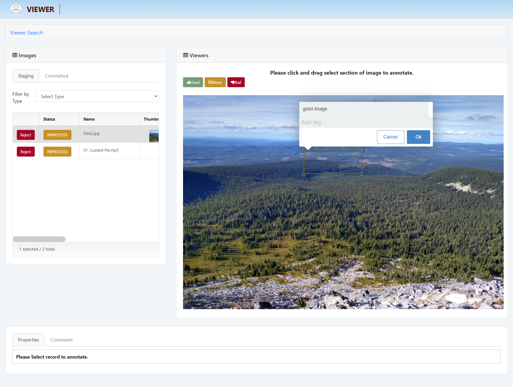

# What is InsightLake Data Intake?

InsightLake Data Intake solution is a packaged solution which consists of Web UI, Desktop application, Mobile framework & REST, SFTP & Streaming endpoints. This solution can be easily deployed on Cloud (AWS, GCP, Azure) or on-premise.
 It enables a company's vendors/partners to upload data in a secure, reliable and governed manner with a workflow driven mechanism. 

Data Intake allows partners/vendors to upload a variety of data sets like CSV, documents, images, videos etc. Data Intake allows vendors to upload the data using different channels:
* Web UI - Intuitive UI
* SFTP : Apps like FileZilla
* Desktop Applications - CLI & App 
* Mobile Apps

# Endpoints: 
The Intake package also includes endpoints so any application can utilize them to ingest data.
* Streaming for videos or large data
* REST APIs : Data upload and workflow endpoints
 
# Intake Backend
Intake solution’s backend includes the following:
* Pluggable data storage layer
* Search database
* API endpoints
* Audit libraries
* SFTP Server
* Web UI backend
* Core data engine

A staging workspace is created for vendors/partners where they can upload the data and make modifications if necessary. Once ready they can commit the uploaded data so the company can use it. 

# Personas
* Admin
* Partner/Vendor
* Data Steward
* Data Analyst

Data Intake generates appropriate notifications to the company's data intake team to verify the quality of the uploaded data.

## Data Intake

Data intake contain staging as well as committed images. videos and Lidar, vendor can upload and committed images, videos and Lidar
* Upload single and multiple Images, video and Lidar
* Commit single and multiple Images, videos and Lidar
* View Images, videos and Lidar in large format

## Partner/Vendor Activity

Intake solution allows to see the vendor activities done throughout the application.

## Notifications

Intake solution allows to see the notification related to inspector rejection of images, videos and Lidar

## Viewer

Viewers can view all types like images, videos and Lidar. It annotates images and videos. Also it can see the properties and comment of images and videos.

It can reject specific images and videos if the images and videos are not good.

## Review

## Audit

Admin can see the user activities done throughout the application.

## FTP

Admin can manage and add FTP users accounts.

## Dashboaard

Admin can see the daily data analytics and vendors activities with the help of graphical format (charts) . Realtime charts could be used for operational dashboards.

## FTP Application
Data Intake solution starts a secure FTP server, which can be used by vendors/partners to upload the data. Using off the shelf FTP tools like FileZilla etc they can connect to their staging area and upload large file (images, videos etc.). 

After uploading the files in the staging area vendors/partners can use the Data intake web UI for workflow management.

## Desktop Application
Desktop application is a cross platform application, which allows partners/vendors to upload the content securely. The application can upload large data files (images, videos etc.) in GBs. Vendor/partner can select a folder from his/her computer and upload the content to the staging area. 
Application verifies the content before uploading and flags for errors. For example if quality is bad it will alert the user of the bad quality. Administrators can set up rules for different file types and these rules can integrate with ML classification/prediction models as well.

When a partner/vendor is done he/she can commit the staging area changes. Partner/vendor can also check the activity logs and visualize the content in the app.

## Mobile Applications
Data Intake solution provides a framework for mobile applications (iOS, Android, Salesforce Lightning). The framework integrates with the backend services to securely upload the data and manage the data intake workflows.

To learn more, check out [http://insightlake.com/data-intake.html](http://insightlake.com/data-intake.html)

Installation
------
* Download or clone the repository. 
* Run bin/insightlake command.
* Open browser with URL as http://localhost:8080/
* Change configuration in /conf folder to set different ports
* By default H2 database is used, you can change the database details in jdbc.properties file

Installation using docker 
------
* Download or clone the repository. 
* cd /docker
* Run `docker-compose -f docker-compose.yaml up --build`
* Open browser with URL as http://localhost:8080/
* While creating Data Location use below credentials  

        * username : root
        * password : password

License
------
InsightLake Data Intake is a commercial product but distributed to be used freely. Please contact contact@insightlake.com for details.

Getting Help
----------

You can get help easily :
Community - Google Groups
Slack Channel
Twitter
Facebook
Email: contact@insightlake.com
